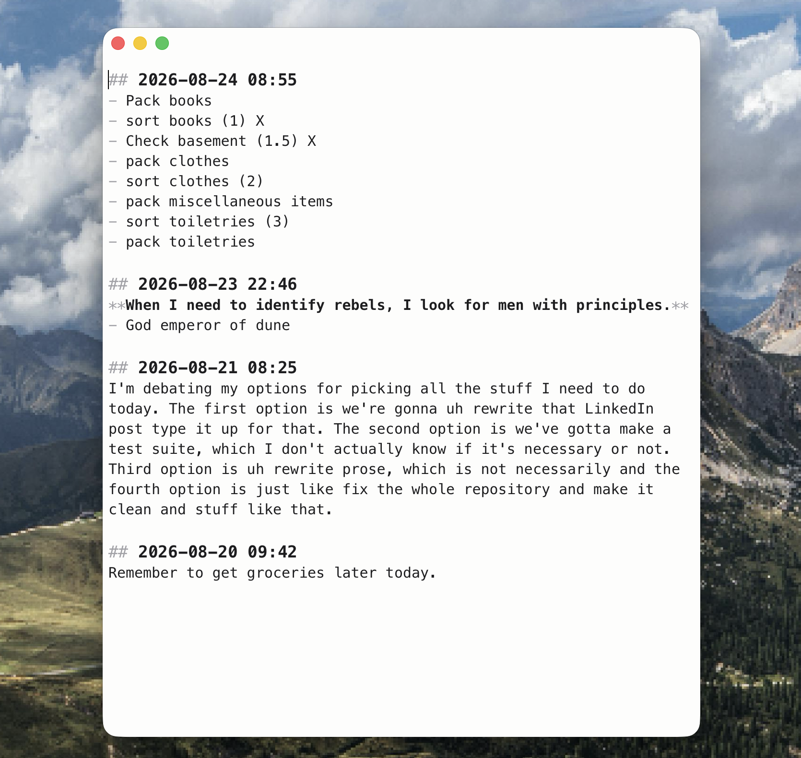

# Talkie

**The modern notepad.**

Set up one shortcut to immediately transcribe notes to a markdown file. Can be combined with an Openclaw instance to immediately speak to an agent, and can be used with Obsidian as a voice notes platform.



## Running it

Requires [Rust](https://rustup.rs/) (via rustup) and
[Trunk](https://trunkrs.dev/) (`cargo install trunk`). No node, no npm.

```sh
cargo tauri dev
```

`cargo tauri build` produces the `.app`/`.dmg`.


# About

## Inspiration

Based on [Handy](https://github.com/cjpais/handy), a great FOSS app for voice transcription.

## Architecture

Rust end to end: [Tauri 2](https://tauri.app) hosting a
[Leptos](https://leptos.dev) CSR frontend compiled to WASM by Trunk. The one
piece of JavaScript is a frozen [CodeMirror 6](https://codemirror.net) bundle
behind a typed wasm-bindgen wrapper — see `ui/assets/vendor/README.md`.

Speech recognition uses Parakeet V3 through
[transcribe-rs](https://crates.io/crates/transcribe-rs); the audio capture,
resampling, and VAD code is ported from Handy (MIT) with its notice retained.

## License

PolyForm Noncommercial 1.0.0 — see `LICENSE`. The ported Handy audio code remains MIT.
